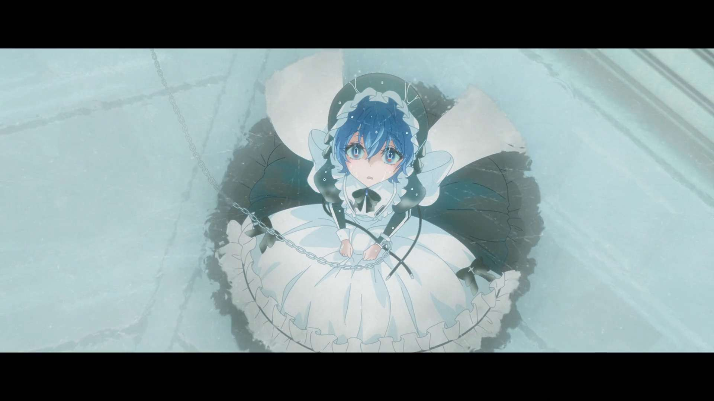

Hello, welcome back to my blog, and welcome to my first ever anime review. The first anime that I’ll be reviewing is Shiboyugi: Playing Death Games to Put Food on the Table. Just as a warning, this review will be filled with spoilers. If you are thinking of watching the anime, don’t read this yet. I’m writing this review right after finishing the last episode, so my mind is still fresh with thoughts about the anime. I watched the anime by following it throughout the season, which is Winter 2026.

The vibe of the anime is great, but at the same time, I think they focused too much on it. I read a bit of the light novel and the manga and I thought it may not be the best way to adapt it in my opinion. It was made kind of weird. The way they deliver the story in the light novel and the manga feels so much different than the anime. The light novel and the manga were written more expressively, while the anime was more beautiful, atmospheric, and psychological. I personally prefer the story delivery of the light novel and the manga instead. Talking about vibes, the art style of the anime has its own uniqueness. Very obviously seen from the eyes of the characters and also how some scenes were drawn.

The first episode of the anime was a banger. My expectations for the anime were really high because of it. It also traumatized me for a day or two (RIP Aoi). I started the series blind, so I was surprised at the rate they killed characters. I also thought that the whole anime would focus on one game, but I was wrong. 

Another thing I want to talk about is the OP and ED. Well, the OP is pretty much non-existent, so I’m not going to talk about it. The ED though, I love it so much. I didn’t really like it at first, but now it’s one of my favorites this season. It’s Inori by Chiai Fujikawa and I already knew her for a while because she also sang most of the EDs for Shield Hero.

<iframe data-testid="embed-iframe" style="border-radius:12px" src="https://open.spotify.com/embed/track/5lhpdsLwynYUVmW8pJP8aT?utm_source=generator" width="100%" height="152" frameBorder="0" allowfullscreen="" allow="autoplay; clipboard-write; encrypted-media; fullscreen; picture-in-picture" loading="lazy"></iframe>

Overall, the anime was decent. I’m just a bit disappointed at how they adapted the anime, especially after knowing what the light novel and manga were like. I wish they could’ve been more faithful to them, rather than focusing on beauty and atmosphere. Even though the anime didn’t really meet the expectations that I had after watching the first episode, I still would love another season because the story of the series itself is really interesting. And honestly, I would love to read the light novel if it was accessible for me.