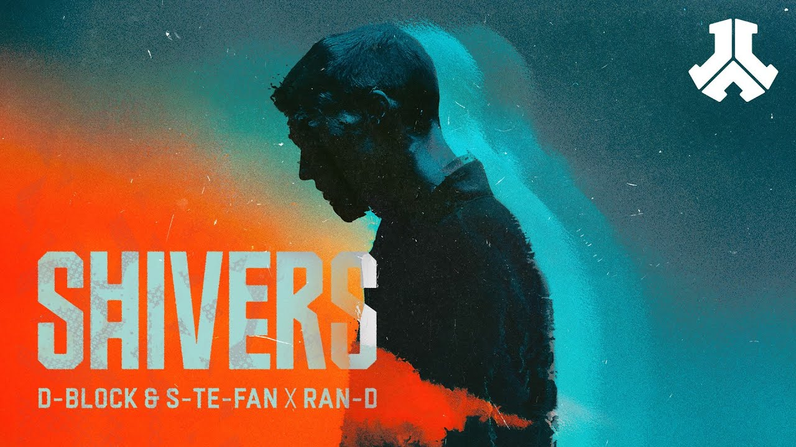

<iframe data-testid="embed-iframe" style="border-radius:12px" src="https://open.spotify.com/embed/track/7aIgUTEPXjRH19raLJwRMG?utm_source=generator" width="100%" height="152" frameBorder="0" allowfullscreen="" allow="autoplay; clipboard-write; encrypted-media; fullscreen; picture-in-picture" loading="lazy"></iframe>

Notes: This is just a test article but one day I'll actually review this track

Hello there. This is my very first article, so I'm going to add a lot of stuff here to test out how to make static website with Blowfish. 

Let's try adding an image. Boom!

Lorem ipsum dolor sit amet, consectetur adipiscing elit. Proin elementum est sit amet vulputate pretium. Etiam a auctor est. Vestibulum quis consectetur nulla, sit amet cursus velit. Sed enim erat, hendrerit ut lobortis sit amet, finibus et orci. Quisque semper nunc eu vestibulum luctus. Quisque sit amet enim et nisl condimentum porttitor eget sed neque. Aenean erat dui, tempus sit amet mi sit amet, dapibus semper sapien. Nam nec molestie dolor. Quisque ac quam mollis, efficitur metus vel, tempus dolor. Nulla dapibus urna metus, ac sagittis metus dapibus quis. Aenean viverra velit orci, ut dapibus nulla porttitor at. Pellentesque habitant morbi tristique senectus et netus et malesuada fames ac turpis egestas. Aliquam sed efficitur nunc, quis euismod libero. In et lacus semper, accumsan risus tincidunt, volutpat tellus. Fusce condimentum varius interdum. Mauris efficitur facilisis sapien, vitae vulputate nibh consequat eu.

Nam id porttitor tellus, eget ornare libero. Integer in nisl nisl. Nullam vel consequat augue, eget pellentesque tellus. Nullam gravida, quam placerat semper fermentum, nisl est elementum dui, et fermentum ex sapien non diam. Donec quis mi lobortis, vulputate eros id, facilisis nisi. Pellentesque egestas posuere odio. Praesent rhoncus tellus ipsum, aliquet commodo purus porta sed. Quisque id rutrum felis, ac feugiat odio. Suspendisse convallis consectetur turpis eget dictum. Morbi neque quam, ultrices vitae massa et, condimentum mattis tortor. Nullam venenatis mi massa. Vivamus vel turpis in mi vehicula suscipit. Maecenas mattis arcu vitae ex sagittis convallis in euismod metus.

Aliquam sed turpis elit. Nullam at vulputate felis. Integer felis lectus, sagittis nec condimentum at, dignissim quis risus. Pellentesque vel ante semper nulla finibus feugiat ut vel risus. Nulla ullamcorper non augue iaculis sagittis. Aliquam a arcu feugiat, facilisis sapien id, rutrum mauris. Aliquam rutrum, eros ac vulputate elementum, justo orci vulputate ante, vel finibus dolor ex quis velit. Integer et risus urna. Praesent sed rhoncus nisi. Ut ac quam nec sapien efficitur tristique.

Aliquam mattis, tellus et mattis ornare, mi dui dapibus tellus, vel interdum risus libero a urna. Vivamus tempor commodo lectus at congue. Nullam lobortis eget lorem vel sollicitudin. Aliquam eleifend tellus sed velit condimentum dapibus. Pellentesque dapibus interdum dui, vitae porttitor ante malesuada nec. Sed sed eros eget mi eleifend facilisis. Nullam egestas vel libero ultrices rhoncus. Nam vulputate interdum lectus in euismod.